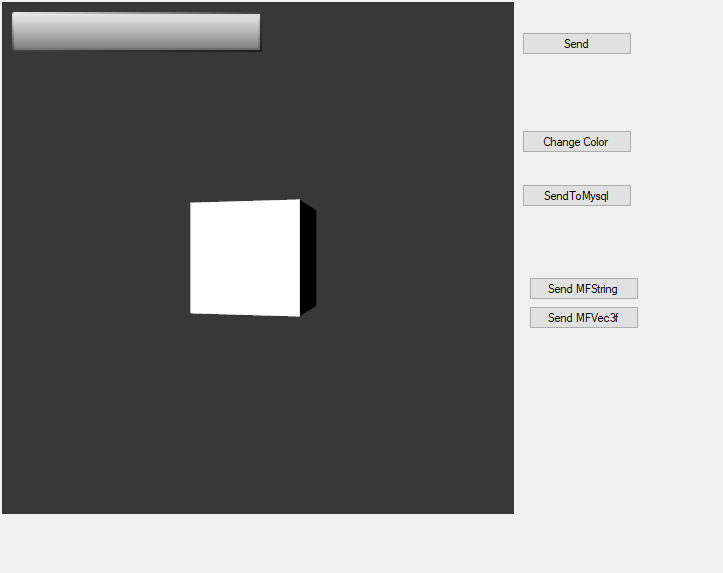

# 3.教程

## EON端

1.让我们准备一个新项目，进入到Routes:Simulation中设置数据蓝图，创建收入数据、发送数据的节点。


2.打开script，引入外部信息变量

```text
var text = eon.FindNode("ExternalMessage").GetFieldByName("Text");
text.value = "";

var mfText = eon.FindNode("MFStringMessage").GetFieldByName("Text");
mfText.value = "";
```

3.向外部传字符串信息

```text
function On_SomeExternalEventIn()
{

	text.value = SomeExternalEventIn.value
	
	mfText.value = "Sent from kison";

}
```

4.接受外部MF String信息

```text
function On_RecvMFString()
{
	mfText.value = "";
	for(var i = 0; i < RecvMFString.GetMFCount(); i++)
	{
		mfText.value += RecvMFString.GetMFElement(i);

		if(i + 1 < RecvMFString.GetMFCount())
		{
			mfText.value +=", ";
		}
	}
}
```

5.接受外部参数信息

```text
function On_RecMFVec3f()
{
	text.value = "Recieved a MF Vec3f";

	for(var i = 0; i < RecvMFVec3f.GetMFCount(); i++)
	{
		var row = RecvMFVec3f.GetMFElement(i);
	
		output += " ( ";
		for(var j = 0; j< row.leangth; j++)
		{
			output += row[j];

			if(j + 1 < row.length)
				output+= ", ";
		}
		
		output += ")\n";
	}
	
	mfText.value = output;
}
```

## VS端

1.首先打开窗体，设置按钮功能位置参数


2.点击标签，进行详细功能设置


3.引入EONX插件


4.信息传输功能

```text
        private void Form1_Load(object sender, System.EventArgs e)
        {
            axControl21.OnEvent += AxControl21OnOnEvent;
        }

        public void AxControl21OnOnEvent(object sender, _IControlEvent_OnEventEvent e)
        {
            switch (e.bstrNodeName)
            {
            //ext_String 即为eon传来的数据，数据值为e.pvarNodeValue
                case "ext_String":
                    lblRecvEvent.Text = e.pvarNodeValue.ToString();
                //输入你想要的操作
            }
        }
```

5.VS给EON画面传输数据

```text
        private void btnSendEvent_Click(object sender, System.EventArgs e) 
        {
            string message = "Sent from Visual Studio";           
            SendEONEvent("int_String", message);
        }
```

6.VS改变EON应用中的物体颜色

```text
        private void btnColor_Click(object sender, EventArgs e)
        {
            float[] values = { 0.15f, 0.75f, 0.15f };

            object[] obj = values.OfType<object>().ToArray();

            SendEONEvent("int_ArrayColor", obj);
        }
```

7.更多功能请看后续章节

## 项目具体呈现效果




